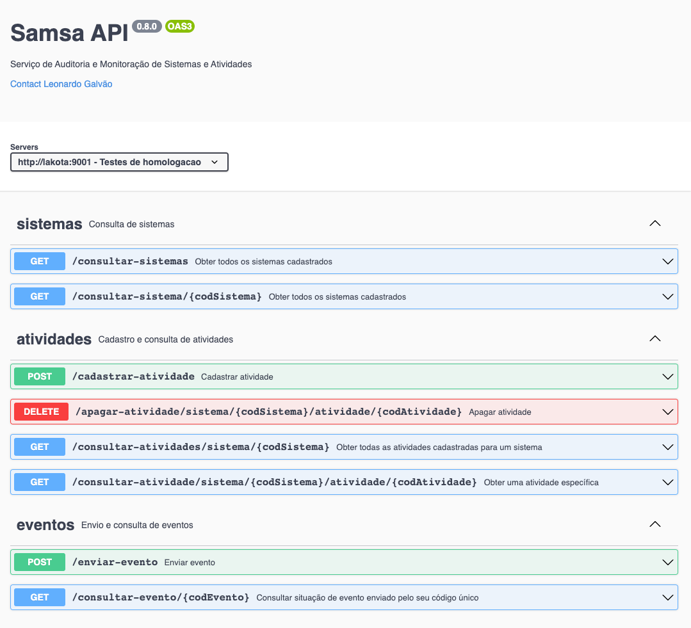

= Samsa Cliente

*Exemplos de acesso à API do Samsa*

== Os exemplos
Este projeto inclui dois exemplo de uso do SAMSA.

* Um exemplo completo (`samsa.cliente.ClienteSamsaCompleto`) que vai da verificação de um sistema e cadastro de atividades a serem auditadas, até o envio de eventos e a posterior verificação se os eventos chegaram ao Kafka.
* Um exemplo mínimo (`samsa.cliente.ClienteSamsaMinimo`) que presume a existência do Sistema e das Atividades, e faz o envio de um evento – mas sem depois verificar a chegada no Kafka.

Os exemplos são ilustrativos. A forma de usar nos seus sistemas vai variar bastante, de acordo com a arquitetura e a tecnologia utilizadas.

== Ferramentas e Dependências
Os exemplos usam a API HttpClient, nativa no Java 11 em diante, e o Jackson para mapear objetos de/para JSON. Também é usado o Lombok para redução de código 'boilerplate'.

Sobre HttpClient:

* https://openjdk.java.net/groups/net/httpclient/recipes.html

Sobre Jackson:

* https://www.baeldung.com/jackson-object-mapper-tutorial

Sobre Lombok:

* https://www.baeldung.com/intro-to-project-lombok

== Como executar
Os exemplos usam o gradle, mas não é necessário instalar a ferramenta. No Windows, rode:

[source,shell script]
----
gradle run
----

Isso irá executar o exemplo completo.

== DTOs
O pacote `samsa.cliente.modelo` inclui os DTOs úteis para organizar a serializacao/desserializacao. Detalhes sobre esses DTOS a seguir:

=== Evento
Conceito principal do sistema.

[source,Java]
----
public class Evento {
    String codSistema;
    String codAtividade;
    String dataHora;
    String descricao;
    String destinoIp;
    String destinoPorta;
    String destinoUrl;
    String origemIp;
    String origemHorasFuso;
    String usuarioLogin;
    String usuarioNome;
    String usuarioSiglaLotacao;
    Map<String, String> propriedades;
}
----

=== Atividade
Ação realizada no sistema que deve ser registrada no SAMSA. Pode ser visto como um 'tipo de evento'.

[source,Java]
----
public class Atividade {
    String codSistema;
    String codAtividade;
    String descAtividade;
}
----

=== SituacaoEnvio
Agrega dados/erros retornados ao enviar um evento (endpoint `/enviar-evento`).

[source,Java]
----
public class SituacaoEnvio {
    CodSituacaoEnvio codSituacao; //ACEITO, REJEITADO, ERRO_INTERNO
    String codEvento;
    Map<String, String> erros;
}
----

=== SituacaoRecebimento
Agrega dados retornados ao consultar um evento (endpoint `/consultar-evento`), passando o código.

[source,Java]
----
public class SituacaoRecebimento {
  CodSituacaoRecebimento codSituacao; //PENDENTE, CONFIRMADO, NAO_ENCONTRADO, ERRO_INTERNO
  String codEvento;
  Map<String, String> erros;
  String dataHoraConfirmacao;
}
----

=== Endpoints da API

